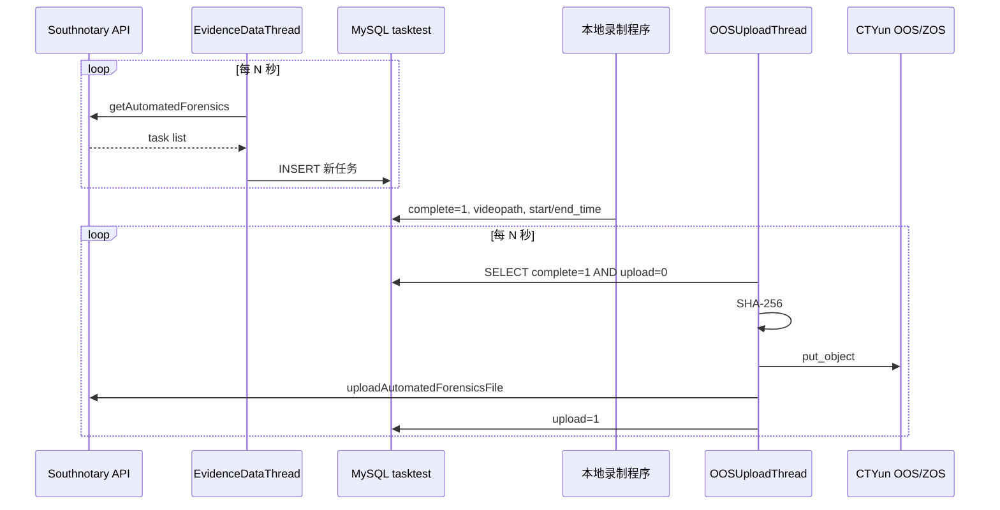

# Southnotary OOS Uploader

南方公证处（`www.southnotary.cn`）自动取证任务同步 + 天翼云 OOS/ZOS 视频上传服务。

## 三种启动方式

| 方式 | 命令 | 说明 |
|------|------|------|
| **单文件（推荐，等同原始脚本）** | `python oos_uploader_southnotary.py` | 根目录单文件，结构与原脚本一致 |
| 模块化包 | `python -m southnotary_uploader` | 带 doctor、重试、更细配置 |
| 启动脚本 | `./scripts/run_uploader.sh` | 自动加载 `.env` 后运行单文件版 |

```bash
cp .env.example .env
# 编辑 .env，填入公证处 API 凭证、OOS AK/SK、MySQL 连接
python oos_uploader_southnotary.py
```

---

| 能力 | 说明 |
|------|------|
| 任务拉取 | 定时调用公证处开放接口 `getAutomatedForensics` |
| 任务入库 | 写入 MySQL `tasktest`，按 `domain + taskid` 去重 |
| 平台映射 | 将 `platform` 编号映射为 `Douyin`、`Xiuse` 等应用名 |
| Xiuse 修正 | `roomId=0` 时从 URL 末尾提取数字 roomId |
| 视频上传 | 计算 SHA-256，上传至天翼云 OOS/ZOS |
| 结果回调 | 调用 `uploadAutomatedForensicsFile` 通知公证处 |
| 终态处理 | 任务已结束/不存在时仍标记 `upload=1`，避免死循环重试 |
| ZOS 兼容 | 内置 `huanan2.zos.ctyun.cn` endpoint region 解析补丁 |

此外包含 **`scrcpy_manager`** 录屏执行服务：通过 ADB + scrcpy 在 Android 设备上执行各平台直播 App 任务并录屏，回写 `tasktest.complete=1`。与上传服务通过数据库解耦。

端到端流程见 [docs/DATA_FLOW.md](docs/DATA_FLOW.md)。

---

## 目录结构

```
.
├── main.py                          # 传统启动入口
├── db_utils.py                      # 兼容旧脚本的 MySQLConnector 重导出
├── requirements.txt                 # 运行时依赖
├── requirements-dev.txt             # 开发依赖
├── pyproject.toml                   # 打包元数据
├── .env.example                     # 环境变量模板
├── Dockerfile                       # 容器镜像
├── docker-compose.yml               # 容器编排
├── config/
│   ├── config.example.yaml          # 上传服务配置参考
│   └── config.ini.example           # 录屏服务 config.ini 模板
├── scrcpy_manager/                  # Android scrcpy 录屏调度服务
├── deploy/
│   └── southnotary-uploader.service # systemd 单元文件
├── docs/
│   ├── ARCHITECTURE.md              # 架构设计
│   ├── API.md                       # 公证处接口说明
│   ├── DATABASE.md                  # 数据库设计
│   ├── DEPLOYMENT.md                # 部署手册
│   └── TROUBLESHOOTING.md           # 故障排查
├── legacy/
│   ├── README.md
│   └── oos_uploader_southnotary.py  # 旧脚本兼容入口
├── scripts/
│   ├── start.sh                     # 虚拟环境启动脚本
│   └── check_env.py                 # 环境变量检查
├── sql/
│   └── tasktest.sql                 # 建表 SQL
├── southnotary_uploader/            # 主程序包
│   ├── __main__.py
│   ├── cli.py                       # CLI：run / doctor / --once
│   ├── config.py                    # 配置加载与校验
│   ├── constants.py                 # 平台映射、常量
│   ├── models.py                    # 数据模型
│   ├── api.py                       # 公证处 API 客户端（含重试）
│   ├── storage.py                   # OOS 上传与哈希
│   ├── object_key.py                # 对象 Key 生成
│   ├── repository.py                # MySQL 任务仓储
│   ├── service.py                   # 业务编排
│   ├── scheduler.py                 # 定时线程
│   ├── db_utils.py                  # 数据库连接
│   ├── ctyun_patch.py               # ZOS endpoint 补丁
│   ├── env_loader.py                # .env 自动加载
│   ├── logging_config.py            # 日志配置
│   └── utils.py                     # 工具函数
└── tests/                           # 单元测试
```

---

## 业务流程



> 本服务**不负责录屏**。录制程序需自行消费 `tasktest` 任务并在完成后更新 `complete`、`videopath`、时间字段。

---

## 快速开始

### 1. 安装依赖

```bash
python3 -m venv .venv
source .venv/bin/activate
pip install -r requirements.txt
```

### 2. 安装天翼云 OOS SDK

SDK 需从天翼云控制台下载源码包安装（非 PyPI）：

```bash
cd /path/to/oos-python-sdk-6.5.0
python3 -m pip install .
python3 -c "import oos, ooscore; print('OK')"
```

### 3. 配置环境变量

```bash
cp .env.example .env
# 编辑 .env，填入真实凭证
```

服务启动时会自动尝试加载项目根目录的 `.env`（依赖 `python-dotenv`）。

### 4. 初始化数据库

```bash
mysql -h "$MYSQL_HOST" -u "$MYSQL_USER" -p"$MYSQL_PASSWORD" "$MYSQL_DATABASE" < sql/tasktest.sql
```

### 5. 检查环境

```bash
python3 scripts/check_env.py
python3 -m southnotary_uploader doctor
```

### 6. 启动服务

```bash
python3 -m southnotary_uploader
# 或
./scripts/start.sh
```

---

## 运行模式

| 命令 | 说明 |
|------|------|
| `python -m southnotary_uploader` | 默认常驻，启动双定时线程 |
| `python -m southnotary_uploader --once fetch` | 单次拉取任务并入库 |
| `python -m southnotary_uploader --once upload` | 单次上传已完成任务 |
| `python -m southnotary_uploader --once both` | 单次执行拉取 + 上传 |
| `python -m southnotary_uploader doctor` | 健康检查（MySQL/API/OOS） |
| `python -m southnotary_uploader doctor --json` | JSON 格式诊断输出 |

---

## 环境变量完整说明

### 公证处 API

| 变量 | 必填 | 默认值 | 说明 |
|------|------|--------|------|
| `SOUTHNOTARY_DOMAIN_ID` | 否 | `southnotary` | 租户/域名标识，写入 `tasktest.domain` |
| `SOUTHNOTARY_BASE_URL` | 否 | `https://www.southnotary.cn/api` | API 基础地址 |
| `SOUTHNOTARY_API_HOST` | 否 | `www.southnotary.cn` | API 主机名 |
| `SOUTHNOTARY_APPID` | **是** | - | 应用 ID |
| `SOUTHNOTARY_RANDKEY` | **是** | - | 随机 key |
| `SOUTHNOTARY_HASHVAL` | **是** | - | 签名哈希 |

### 天翼云 OOS / ZOS

| 变量 | 必填 | 默认值 | 说明 |
|------|------|--------|------|
| `OOS_ACCESS_KEY` | **是** | - | Access Key |
| `OOS_SECRET_KEY` | **是** | - | Secret Key |
| `OOS_ENDPOINT` | 否 | `https://huanan2.zos.ctyun.cn` | OOS endpoint |
| `OOS_BUCKET` | 否 | `bucket-azy-southnotary` | 存储桶 |
| `OOS_OBJECT_KEY_PREFIX` | 否 | `evidenceProd/Casefile/File` | 对象 Key 前缀 |
| `OOS_SIGNATURE_VERSION` | 否 | `s3` | 签名版本 |
| `OOS_SERVICE_NAME` | 否 | `s3` | 服务名 |
| `OOS_API_VERSION` | 否 | `2006-03-01` | API 版本 |

对象 Key 最终格式：

```
{OOS_OBJECT_KEY_PREFIX}/{YYYY-MM-DD}/{unix_timestamp}/{filename}
```

### MySQL

| 变量 | 必填 | 默认值 | 说明 |
|------|------|--------|------|
| `MYSQL_HOST` | **是** | - | 主机 |
| `MYSQL_PORT` | 否 | `3306` | 端口 |
| `MYSQL_USER` | **是** | - | 用户名 |
| `MYSQL_PASSWORD` | **是** | - | 密码 |
| `MYSQL_DATABASE` | **是** | - | 数据库名 |
| `MYSQL_CHARSET` | 否 | `utf8mb4` | 字符集 |
| `MYSQL_CONNECT_TIMEOUT_SECONDS` | 否 | `10` | 连接超时 |

### 运行时

| 变量 | 必填 | 默认值 | 说明 |
|------|------|--------|------|
| `EVIDENCE_FETCH_INTERVAL_SECONDS` | 否 | `10` | 拉取任务周期（秒） |
| `UPLOAD_INTERVAL_SECONDS` | 否 | `10` | 上传任务周期（秒） |
| `HTTP_TIMEOUT_SECONDS` | 否 | `30` | HTTP 超时 |
| `HTTP_VERIFY_SSL` | 否 | `true` | 是否校验 HTTPS 证书 |
| `API_RETRY_COUNT` | 否 | `3` | API 请求重试次数 |
| `API_RETRY_BACKOFF_SECONDS` | 否 | `1.0` | 重试退避基数 |
| `LOG_LEVEL` | 否 | `INFO` | 日志级别 |
| `LOG_DIR` | 否 | `./logs` | 日志目录 |
| `DOTENV_PATH` | 否 | - | 指定 .env 文件路径 |

---

## 平台编号映射

| platform | appname |
|----------|---------|
| 3 | Douyin |
| 5 | Kuaishou |
| 7 | Ailiao |
| 11 | Huajiao |
| 12 | Yingke |
| 14 | Lespark |
| 17 | Mifeng |
| 18 | Momo |
| 21 | Xiaohongshu |
| 22 | Xiuse |
| 24 | Baobao |
| 27 | Kelakela |
| 33 | Aichang |
| 36 | Lingsheng |
| 43 | Hongguo |

---

## 部署方式

详细步骤见 [docs/DEPLOYMENT.md](docs/DEPLOYMENT.md)。

| 方式 | 文件 |
|------|------|
| systemd | `deploy/southnotary-uploader.service` |
| Docker | `Dockerfile`, `docker-compose.yml` |
| 裸机脚本 | `scripts/start.sh` |

---

## 文档索引

| 文档 | 内容 |
|------|------|
| [docs/ARCHITECTURE.md](docs/ARCHITECTURE.md) | 模块划分、线程模型、业务规则 |
| [docs/API.md](docs/API.md) | 公证处开放接口字段与示例 |
| [docs/DATABASE.md](docs/DATABASE.md) | `tasktest` 表结构与 SQL |
| [docs/DEPLOYMENT.md](docs/DEPLOYMENT.md) | 安装、配置、上线检查清单 |
| [docs/DATA_FLOW.md](docs/DATA_FLOW.md) | 创基数据端到端流程（拉取→录屏→上传） |

---

## 开发

```bash
pip install -r requirements-dev.txt
python3 -m unittest discover -s tests
python3 -m compileall southnotary_uploader tests main.py
```

---

## 安全说明

- **切勿**将 AccessKey、数据库密码、`hashval` 提交到版本库。
- 生产环境通过 systemd `EnvironmentFile` 或容器 `env_file` 注入密钥。
- 日志默认不打印完整 token 与密钥；`doctor` 输出为脱敏配置摘要。

---

## 与原始脚本差异

| 项目 | 原始脚本 | 本项目 |
|------|----------|--------|
| 结构 | 单文件 | 模块化 Python 包 |
| 凭证 | 硬编码在源码 | 环境变量 / `.env` |
| 诊断 | 无 | `doctor` + `check_env.py` |
| 文档 | 无 | 完整 docs/ |
| 部署 | 手动 | systemd / Docker / 脚本 |
| 数据库 | 隐式依赖 | `sql/tasktest.sql` + 仓储层 |
| API 重试 | 无 | 可配置重试与退避 |
| 测试 | 无 | unittest |

核心业务行为（对象路径、回调逻辑、Xiuse 修正、终态 500 处理、ZOS 补丁）均保持一致。
