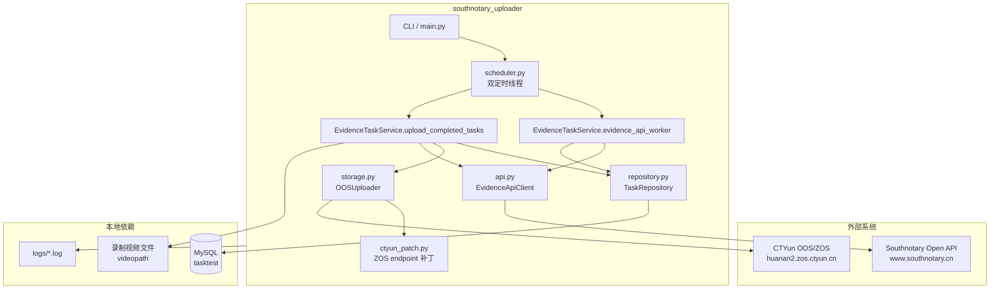

# 南方公证处取证上传服务 — 架构说明

## 1. 业务背景

本服务用于对接 **南方公证处（www.southnotary.cn）** 的自动取证开放接口，并与本地录制系统、MySQL 任务库、天翼云 OOS/ZOS 对象存储协同工作。

典型业务链路如下：

1. 公证处平台下发取证任务（直播间 URL、案号、任务 ID 等）。
2. 本服务定时拉取任务并写入 MySQL `tasktest` 表。
3. 本地录制程序消费任务并完成录屏，将 `complete=1`、`videopath`、起止时间写回数据库。
4. 本服务定时扫描 `complete=1 AND upload=0` 的任务，计算 SHA-256，上传视频到 OOS/ZOS。
5. 上传成功后回调公证处 `uploadAutomatedForensicsFile` 接口。
6. 回调成功（或命中特定终态错误）后，将 `upload=1`。

## 2. 系统架构



## 3. 模块职责

| 模块 | 文件 | 职责 |
|------|------|------|
| 入口 | `main.py`, `__main__.py`, `cli.py` | 参数解析、启动模式、健康检查 |
| 配置 | `config.py`, `env_loader.py` | 环境变量加载与校验 |
| 常量 | `constants.py` | 平台映射、终态消息、对象路径前缀 |
| 模型 | `models.py` | 取证任务、上传回调等数据结构 |
| API | `api.py` | Token、拉取任务、上传回调 |
| 存储 | `storage.py`, `object_key.py` | SHA-256、OOS 上传、对象 Key 生成 |
| 数据库 | `db_utils.py`, `repository.py` | 连接管理与任务 CRUD |
| 业务 | `service.py` | 拉取入库、上传回调编排 |
| 调度 | `scheduler.py` | 可停止的周期线程 |
| 补丁 | `ctyun_patch.py` | 兼容 `*.zos.ctyun.cn` endpoint |
| 工具 | `utils.py` | 时间格式化、Xiuse roomId 修正 |

## 4. 双线程调度模型

服务默认启动两个 **daemon 线程**，互不阻塞：

| 线程名 | 默认周期 | 执行函数 | 说明 |
|--------|----------|----------|------|
| `EvidenceDataThread` | 10 秒 | `evidence_api_worker` | 拉取公证处任务并入库 |
| `OOSUploadThread` | 10 秒 | `upload_completed_tasks` | 上传已完成视频并回调 |

线程收到 `KeyboardInterrupt` 或 `stop()` 后，会在当前周期结束后退出，避免中断数据库/OOS 操作中途状态不一致。

## 5. 关键业务规则

### 5.1 任务去重

入库前执行：

```sql
SELECT COUNT(*) FROM tasktest WHERE taskid = ? AND domain = ?
```

`domain` 默认为 `southnotary`，保证多租户场景下按域名隔离。

### 5.2 Xiuse 平台 roomId 修正

当 `appname == "Xiuse"` 且 `roomId == "0"` 时，从 URL 末尾提取数字作为 roomId：

```
https://example.com/live/123456  ->  roomId = 123456
```

### 5.3 对象存储路径

默认对象 Key 规则：

```
evidenceProd/Casefile/File/{YYYY-MM-DD}/{unix_timestamp}/{filename}
```

可通过环境变量 `OOS_OBJECT_KEY_PREFIX` 修改前缀。

### 5.4 回调终态处理

当回调业务 `code=500` 且 `message` 为以下之一时，仍会将 `upload=1`：

- `取证任务已结束！`
- `取证任务不存在！`

这表示任务在公证处侧已不可继续上传，本地无需反复重试。

## 6. 配置来源优先级

1. 进程环境变量（最高优先级）
2. 可选 `.env` 文件（通过 `python-dotenv` 加载）
3. `config.py` 中的默认值

## 7. 安全建议

- **不要** 将 AccessKey、数据库密码、API hashval 提交到 Git。
- 生产环境使用 `EnvironmentFile`（systemd）或容器 `env_file` 注入密钥。
- 录制视频目录建议只读挂载到上传服务容器。
- 日志中避免打印完整 token 与密钥。

## 8. 与原始单文件脚本的关系

仓库根目录保留 `legacy/oos_uploader_southnotary.py` 作为原始脚本的归档参考；推荐使用模块化后的 `southnotary_uploader` 包进行部署与维护。
