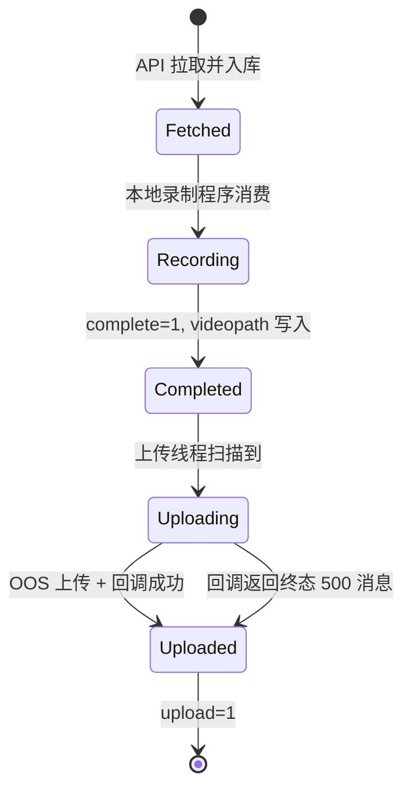

# 数据库设计说明

## 1. 表：`tasktest`

本服务围绕 `tasktest` 表运转。建表脚本见：

```
sql/tasktest.sql
```

### 1.1 字段说明

| 字段 | 类型 | 可空 | 默认值 | 说明 |
|------|------|------|--------|------|
| id | BIGINT | 否 | 自增 | 主键 |
| appname | VARCHAR(64) | 是 | NULL | 平台名称（如 Douyin、Xiuse） |
| task_args | TEXT | 是 | NULL | 直播间 URL |
| title | VARCHAR(512) | 是 | NULL | 直播间标题 |
| roomid | VARCHAR(128) | 是 | NULL | 直播间 ID |
| casenum | VARCHAR(128) | 是 | NULL | 案号 |
| taskid | VARCHAR(128) | 否 | - | 公证处任务 ID |
| forensic_type | VARCHAR(64) | 是 | NULL | 取证类型 |
| domain | VARCHAR(64) | 否 | southnotary | 域名/租户标识 |
| complete | TINYINT(1) | 否 | 0 | 本地录制是否完成 |
| upload | TINYINT(1) | 否 | 0 | 是否已上传并回调成功 |
| videopath | VARCHAR(1024) | 是 | NULL | 本地视频绝对路径 |
| start_time | DATETIME | 是 | NULL | 录屏开始时间 |
| end_time | DATETIME | 是 | NULL | 录屏结束时间 |
| created_at | TIMESTAMP | 否 | CURRENT_TIMESTAMP | 创建时间 |
| updated_at | TIMESTAMP | 否 | 自动更新 | 更新时间 |

### 1.2 索引

| 索引名 | 字段 | 用途 |
|--------|------|------|
| PRIMARY | id | 主键 |
| uk_taskid_domain | taskid, domain | 防止同域名重复入库 |
| idx_domain_complete_upload | domain, complete, upload | 加速扫描待上传任务 |
| idx_domain_taskid | domain, taskid | 加速按任务查询 |

## 2. 服务使用的 SQL

### 2.1 查询待上传任务

```sql
SELECT *
FROM tasktest
WHERE complete = 1
  AND upload = 0
  AND domain = ?
```

### 2.2 检查任务是否已存在

```sql
SELECT COUNT(*) AS count
FROM tasktest
WHERE taskid = ?
  AND domain = ?
```

### 2.3 插入新任务

```sql
INSERT INTO tasktest
  (appname, task_args, title, roomid, casenum, taskid, forensic_type, domain)
VALUES (?, ?, ?, ?, ?, ?, ?, ?)
```

### 2.4 标记上传完成

```sql
UPDATE tasktest
SET upload = 1
WHERE id = ?
```

## 3. 状态机



说明：

- `complete` 与 `videopath` 通常由**录制程序**更新，本服务不负责录制。
- 本服务负责 `Fetched -> Uploaded` 链路中的 API 拉取与上传回调部分。

## 4. 初始化步骤

```bash
mysql -h <host> -u <user> -p <database> < sql/tasktest.sql
```

## 5. 运维查询示例

待上传任务数：

```sql
SELECT COUNT(*) FROM tasktest
WHERE domain = 'southnotary' AND complete = 1 AND upload = 0;
```

今日新入库任务：

```sql
SELECT COUNT(*) FROM tasktest
WHERE domain = 'southnotary' AND DATE(created_at) = CURDATE();
```

上传失败且可重试（文件存在但未 upload）：

```sql
SELECT id, taskid, videopath
FROM tasktest
WHERE domain = 'southnotary'
  AND complete = 1
  AND upload = 0
  AND videopath IS NOT NULL;
```
