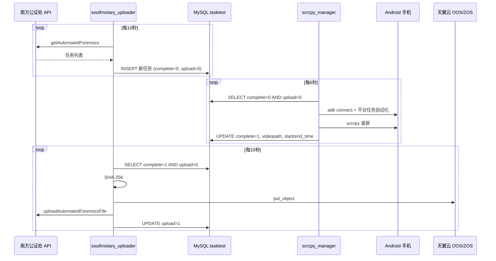

# 创基数据完整流程（端到端）

本文描述从**公证处下发任务**到**视频上传回调完成**的全链路，以及 scrcpy 录屏管理器在其中的位置。

## 系统组成

| 服务 | 模块 | 职责 |
|------|------|------|
| 上传同步服务 | `southnotary_uploader` | 拉取公证处任务入库；上传已完成视频并回调 |
| 录屏执行服务 | `scrcpy_manager` | 扫描 ADB 设备；执行各平台 App 任务；scrcpy 录屏；回写 `complete=1` |

两者通过 MySQL 表 `tasktest` 解耦，可部署在同一台或不同机器。

---

## 总体时序



---

## 阶段 1：创基任务数据（公证处 → 数据库）

**执行者：** `southnotary_uploader` 的 `EvidenceDataThread`

### 1.1 获取 Token

```
GET /fh-evidence/openApi/v1/getCommAuthors
```

### 1.2 拉取任务

```
GET /fh-evidence/openApi/v1/getAutomatedForensics?type=1
```

### 1.3 写入 `tasktest`

| 字段 | 来源 | 初始值 |
|------|------|--------|
| `taskid` | API `taskId` | 必填 |
| `appname` | `PLATFORM_MAP[platform]` | 如 Xiuse、Yingke |
| `task_args` | API `url` | 直播间 URL |
| `roomid` | API `roomId`（Xiuse=0 时从 URL 提取） | |
| `casenum` | API `caseNum` | |
| `forensic_type` | API `forensicType` | |
| `domain` | 配置 `southnotary` | |
| `complete` | - | **0** |
| `upload` | - | **0** |
| `videopath` | - | **NULL** |

**去重规则：** `taskid + domain` 唯一。

---

## 阶段 2：录屏执行（数据库 → 本地 MP4）

**执行者：** `scrcpy_manager`

### 2.1 设备发现

1. `adb devices` 获取已连接设备
2. 扫描 `192.168.31.1~254:5555`（可配置）发现 WiFi ADB
3. `adb connect ip:port` 连接新设备
4. 读取 `manual_devices` 手动补连

### 2.2 加载待录制任务

```sql
SELECT * FROM tasktest
WHERE complete = 0
  AND upload = 0
  AND domain = 'southnotary'
ORDER BY id ASC
```

### 2.3 任务参数解析

| appname 类型 | task_args 传给平台 Task |
|--------------|-------------------------|
| `target_apps` 内（如 Yingke、Xiuse） | `(roomid,)` |
| 其他平台 | `(task_args,)` 即 URL 字符串 |

### 2.4 设备池调度

- `DevicePool`：每台手机同一时刻只跑一个任务
- 多任务时按设备数并发，其余阻塞等待

### 2.5 单任务执行流程

```
① 从设备池获取空闲 device_id
② 检查 adb 连接，断开则重连
③ 实例化平台 Task，如 YingkeTask(device_id, room_id)
④ 启动 ScrcpyRecorder.start()
   - adb getprop ro.serialno 获取序列号
   - scrcpy --record xxx.mp4 --require-audio ...
⑤ 并行执行 platform_task.run_task()
   - 打开对应 App、进入直播间等
⑥ platform 任务结束后 recorder.stop()
   - SIGINT 停止 scrcpy
   - 可选 ffmpeg 音量增强
⑦ 成功：UPDATE tasktest SET complete=1, videopath, start_time, end_time
   失败：删除 mp4，complete 保持 0
⑧ 释放设备回池
```

### 2.6 录屏文件命名

```
recordings/recording_{YYYYMMDDHHMM}_{设备序列号}_{uuid}.mp4
```

---

## 阶段 3：上传与回调（本地 MP4 → 公证处）

**执行者：** `southnotary_uploader` 的 `OOSUploadThread`

### 3.1 查询待上传

```sql
SELECT * FROM tasktest
WHERE complete = 1 AND upload = 0 AND domain = 'southnotary'
```

### 3.2 上传 OOS

1. 计算 `videopath` 的 SHA-256
2. 生成对象 Key：`evidenceProd/Casefile/File/{日期}/{时间戳}/{文件名}`
3. `put_object` 上传至 `bucket-azy-southnotary`

### 3.3 回调公证处

```json
{
  "obsPath": "<object_key>",
  "caseNum": "<casenum>",
  "taskId": "<taskid>",
  "screenStartTime": "<start_time>",
  "screenEndTime": "<end_time>",
  "hash": "<sha256>"
}
```

### 3.4 更新状态

- 回调 `code=200` → `upload=1`
- 回调 `code=500` 且消息为「取证任务已结束！」/「取证任务不存在！」→ 仍 `upload=1`

---

## 任务状态字段对照

| complete | upload | videopath | 含义 |
|----------|--------|-----------|------|
| 0 | 0 | NULL | 已入库，待录制 |
| 0 | 0 | 有值 | 异常（一般不会） |
| 1 | 0 | 有值 | 录制完成，待上传 |
| 1 | 1 | 有值 | 全流程完成 |

---

## 部署建议

```bash
# 终端 1：录屏服务
cp config/config.ini.example config/config.ini
python -m scrcpy_manager --config config/config.ini

# 终端 2：上传服务
cp .env.example .env
python -m southnotary_uploader
```

---

## 相对原 scrcpy 脚本的优化点

| 问题 | 优化 |
|------|------|
| 缺少 `cleanup_old_recordings` | 统一为 `cleanup_old_files` |
| `MySQLConnector(host=...)` 与新版不兼容 | `db_utils.py` 兼容层 |
| 254 线程扫网段 | `ThreadPoolExecutor` 受控并发 |
| import 失败静默 Mock | `allow_mock_tasks=false` 默认拒绝 |
| 未按 `domain` 过滤任务 | SQL 增加 `domain=?` |
| 单文件 800+ 行 | 拆分为 `scrcpy_manager` 包 |
| 模拟任务混入生产 | 仅在配置允许时使用 Mock |
